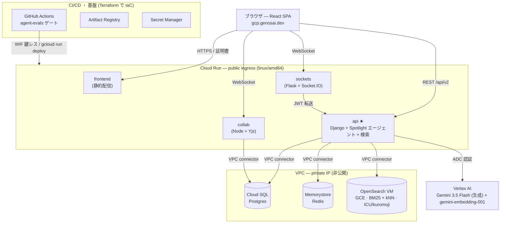

# システムアーキテクチャ / Architecture

Genos の全体構成（インフラ・API・フロントエンド）と、このプロジェクトで加えた DevOps ループの説明です。
**Live:** https://gcp.genosai.dev

---

## 全体像

公開の入口はすべて **Cloud Run**。バックエンド（`api`）が中枢で、DB・キャッシュ・検索は **VPC 内の私設 IP**（インターネット非公開）に置き、AI は **Vertex AI** に問い合わせます。

---

## レイヤ別の詳細

### INFRA — Google Cloud（Terraform で IaC 化 / `infra/gcp`）

公開サービスは **Cloud Run ×4**。データ層は VPC の私設 IP に置き、Cloud Run からは **Serverless VPC Access connector** 経由で到達します（インターネットに露出しない）。

- **Cloud Run**（api / sockets / collab / frontend）— コンテナは **linux/amd64**。api は起動時に migrate/collectstatic を走らせるため広めの startup probe。
- **Cloud SQL（Postgres, private IP）** / **Memorystore（Redis, private）** — Private Service Access で VPC ピアリング。
- **OpenSearch** — マネージド提供が無いため **GCE（Container-Optimized OS）** 上に単一ノード + 永続ディスク。**多言語解析プラグイン（ICU / kuromoji）入りのカスタムイメージ**を実行。
- **Vertex AI** — LLM（生成）と埋め込み。Cloud Run ランタイム SA の **ADC で認証**（鍵ファイル不要）。
- **Artifact Registry**（イメージ）/ **Secret Manager**（機密）/ **VPC + connector + PSA**（ネットワーク）/ **Workload Identity Federation**（CI の鍵レス認証）。

### API — genos-api（Django）+ sockets + collab

`api` が中枢です。REST/認証（JWT）に加え、**Spotlight / Genos AI エージェント**と**検索エンジン**を内包します（本リポジトリの `src/search_engine/`）。

- **エージェント制御ループ**（`agent/controller.py`）— ネイティブの function-calling で「思考 → ツール選択 → 観測 → 反復」。読み取りは即時、**書き込み系ツールは承認カードで一時停止**してから実行（ヒューマン・イン・ザ・ループ）。
- **約60個のツール**（`agent/tools/`）— 検索・一覧・分析（読み）と、タスク/ノート/カレンダー等の作成更新（承認付きの書き）。
- **検索エンジン**（`search.py` 他）— OpenSearch へ **BM25 + ベクトル(kNN)** のハイブリッド、RRF 融合 + 再ランク、鮮度減衰。回答は `[task:123]` 等の**引用**付き。
- **LLM 抽象**（`llm/`）— Gemini/Vertex と Claude を同一プロトコルで扱い、リクエスト単位でモデル選択。
- **sockets**（Flask + Socket.IO）はリアルタイム配信、**collab**（Node/Yjs）はノートの共同編集。いずれも api と同じ JWT を共有。

### FRONTEND — genos-frontend（React 19 + Vite）

チャット/タスク/ノート/プロジェクトの Web クライアント。エージェントは**4つの文脈起点**から同一エンジンを呼びます：Spotlight（Cmd-K の全体パレット）、ノートに聞く、スレッドに聞く、チャット内 ToDo。

- **ストリーミング UI** — `POST /api/v2/agent/ask` の NDJSON を受け、ツール進捗・回答・**承認カード**・引用リンクを逐次描画。
- **ビルド時に `VITE_*` を焼き込み** — 接続先はビルド時固定。GCP 用は `api.gcp.genosai.dev` 等で焼いた専用イメージ（Railway 用とは別イメージ）。

### リクエストの流れ（Spotlight で1回質問したとき）

1. ブラウザが `POST /api/v2/agent/ask`（JWT 付き）を **api** へ。
2. api がエージェントループを起動。**Vertex(Gemini)** が「まず検索するか / どのツールか」を判断。
3. ツール実行 — `search_knowledge_base` は **OpenSearch**、`list_tasks` 等は **Cloud SQL**、埋め込みは **Vertex**（キャッシュは Redis）。
4. 十分な情報が集まると Gemini が**引用付きの最終回答**を生成。書き込み系なら `tool_call_pending_approval` を出して**停止**。
5. **NDJSON**（answer_delta / approval / done）でブラウザへストリーム。承認カードで許可すると `/agent/decide` で再開し実行。

---

## DevOps ループ — evals をゲートに Cloud Run デプロイを守る

`.github/workflows/agent-evals.yml`：PR ごとにエージェントの評価を実行し、品質が落ちたらデプロイをブロックします。テーマ「まわす」を実際に動く形で持っています。

| 段階 | 内容 |
| --- | --- |
| PR | Postgres + OpenSearch を起動 → 決定的 fixture を投入 |
| **Hard gate** | retrieval 評価（**決定的・LLM 無し**）が回帰したら **FAIL → デプロイ skip** |
| Report-only | 挙動スイート + LLM-as-judge（Vertex 経由・非決定的なので非ブロック） |
| main で緑 | build → `gcloud run deploy`（**WIF 鍵レス**） |

> **実バグを検知：** 新規 OpenSearch では最初の reindex 前に `opensearch_setup` が必要で、無いと `embedding` が `knn_vector` 型にならずベクトル検索が無音で全滅（retrieval が **61/64 → 8/64**）。ゲートがこれを止め、修正で緑に。実測：retrieval **61/64**・mrr **0.85**・recall **0.97**、多言語(ICU/kuromoji)緑、TTFT 約 **4.3 秒**。

---

## 2 環境の並行運用（Railway ⇄ GCP）

GCP は独自サブドメイン `gcp.genosai.dev` に載せ、既存 Railway 本番（`genosai.dev`）は一切触っていません。両者は独立した DB/インデックス/機密を持ち、DNS の付け替えで昇格/ロールバックできます（`docs/ENVIRONMENTS.md` に手順）。

| | Railway（現本番） | GCP（並行・新設） |
| --- | --- | --- |
| ドメイン | genosai.dev / api.genosai.dev | gcp.genosai.dev / api.gcp.genosai.dev … |
| コンピュート | Railway（Nixpacks） | Cloud Run ×4 |
| データ/検索 | Railway プラグイン | Cloud SQL / Memorystore / GCE OpenSearch |
| デプロイ | Railway GitHub 連携 | Terraform + evals ゲート付き GitHub Actions |

> フロントは `VITE_*` をビルド時に焼くため、**ドメイン変更＝再ビルド**が必要。Railway 側は無変更なのでロールバックは DNS を戻すだけ（ほぼ即時）。
